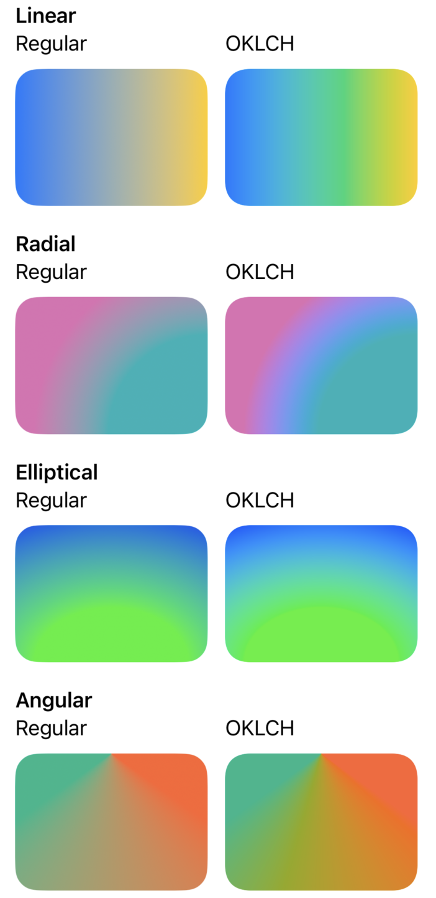

# OKLCH gradients for SwiftUI

This is a drop-in replacement for SwiftUI's built-in [LinearGradient](https://developer.apple.com/documentation/swiftui/lineargradient), [RadialGradient](https://developer.apple.com/documentation/swiftui/radialgradient) and [AngularGradient](https://developer.apple.com/documentation/swiftui/angulargradient) shape styles that utilizes OKLCH color blending to create more visually appealing gradients.

Implemented using iOS 17's [Shader](https://developer.apple.com/documentation/swiftui/shader) API, since that seems to be the only way to make shape styles with custom rendering without relying on private APIs.

Install using SPM:

```swift
dependencies: [
    .package(url: "https://github.com/fwrs/OKLCHGradient.git", .upToNextMajor(from: "1.0.2"))
]
```

To use just prepend `OKLCH` to the gradient struct name:

```swift
// change

Rectangle()
    .background(LinearGradient(
        colors: [.blue, .yellow],
        startPoint: .leading,
        endPoint: .trailing
    ))

// to

import OKLCHGradient

Rectangle()
    .background(OKLCHLinearGradient(
        colors: [.blue, .yellow],
        startPoint: .leading,
        endPoint: .trailing
    ))
```

And enjoy the difference:


